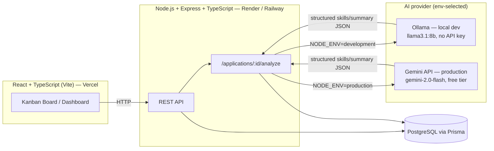

# Job Application Tracker

A full-stack job application tracker with AI-powered job description analysis and skill-match
scoring. A kanban board to track applications through the pipeline, plus a dashboard for
applications-over-time, fit-score trends, and status breakdown.

## Features

- Full CRUD for job applications (company, role, status, dates, notes, resume variant used)
- AI-powered job description parsing: extracts required/preferred skills, seniority, and a summary
- Skill match scoring against a verified skill set, with a 0–100 fit score and matched/missing breakdown
- Resume variant suggestion based on the fit score breakdown
- Kanban board (Applied / Interviewing / Rejected / Offer) with drag-and-drop
- Dashboard with applications-over-time, status breakdown, and fit-score-trend charts

## Tech Stack

**Backend:** Node.js, Express, TypeScript, PostgreSQL, Prisma ORM, Zod (validation)
**AI:** [Ollama](https://ollama.com) (local, dev) / [Gemini API](https://ai.google.dev) (production) — see [AI provider](#ai-provider-ollama-locally-gemini-in-production) below
**Frontend:** React, TypeScript, Vite, Tailwind CSS, Recharts, @dnd-kit
**Testing:** Vitest, Supertest
**Deployment:** Render or Railway (backend + Postgres), Vercel (frontend)

## Architecture



## AI provider: Ollama locally, Gemini in production

`analyzeJobDescription()` (in [`server/src/services/jobAnalysis.ts`](server/src/services/jobAnalysis.ts))
has one function signature and one output shape (`JobDescriptionAnalysis`) regardless of which
model answers it. Both providers are called through the OpenAI-compatible chat completions API —
Ollama natively, Gemini via its [OpenAI-compat endpoint](https://ai.google.dev/gemini-api/docs/openai) —
so the same client code, prompt, and JSON-parse-with-one-retry logic work unchanged for either.

Provider selection is environment-based, resolved once per request by `resolveProvider()`:

| Condition | Provider used |
| --- | --- |
| `AI_PROVIDER=ollama` | Ollama (explicit override, wins over everything) |
| `AI_PROVIDER=gemini` | Gemini (explicit override, wins over everything) |
| `AI_PROVIDER` unset, `NODE_ENV=production` | Gemini |
| `AI_PROVIDER` unset, anything else (default local dev) | Ollama |

**Local development — Ollama, zero cost, no key.** Install [Ollama](https://ollama.com), run
`ollama serve`, pull a model (`ollama pull llama3.1:8b`), and the server talks to it at
`http://localhost:11434/v1` with no API key at all.

**Production — Gemini free tier, zero cost.** Set `NODE_ENV=production` (deploy platforms do
this automatically) and provide `GEMINI_API_KEY` (get one free at
[aistudio.google.com/apikey](https://aistudio.google.com/apikey)). Defaults to
`gemini-2.0-flash`, override with `GEMINI_MODEL` (e.g. `gemini-1.5-flash`). Both models are
available on Gemini's free tier.

Nothing about the OpenAI package usage changes: only `baseURL`, `apiKey`, and `model` swap based
on the resolved provider — see [`server/.env.example`](server/.env.example) for every variable.

## Data Model

- **Application** — company, role, status, appliedDate, jobUrl, resumeVariant, notes, fit score
- **Company** — name, industry, size
- **Contact** — name, role, email, linkedinUrl (linked to an Application)
- **Skill / UserSkill** — verified skill set used for match scoring

## Local Setup

Requires a running PostgreSQL instance.

```bash
# Backend
cd server
npm install
cp .env.example .env    # set DATABASE_URL; Ollama defaults need no API key
npx prisma migrate dev --name init
npm run seed             # loads sample applications
npm run dev               # http://localhost:4000

# Frontend (in a separate terminal)
cd client
npm install
cp .env.example .env     # set VITE_API_URL if not the default
npm run dev                # http://localhost:5173
```

### API

| Method | Route                          | Description                          |
| ------ | ------------------------------- | ------------------------------------ |
| GET    | `/applications`                 | List applications (`?status=` filter) |
| GET    | `/applications/:id`             | Get a single application              |
| POST   | `/applications`                 | Create an application                 |
| PATCH  | `/applications/:id`             | Update an application                 |
| DELETE | `/applications/:id`             | Delete an application                 |
| POST   | `/applications/:id/analyze`     | Analyze a pasted job description      |
| GET    | `/applications/:id/resume-suggestion` | Get a resume variant suggestion |

`POST`/`PATCH` bodies are validated with Zod. `companyName` is required on create; the API upserts
the related `Company` record automatically.

## Testing

```bash
cd server
npm test          # unit tests (match scoring, resume suggestion, AI provider selection)
                   # + an end-to-end smoke test that exercises the real API + Postgres
                   # (create -> analyze -> read back), with the AI call stubbed so it
                   # never depends on Ollama/Gemini being reachable
```

See [`server/src/__tests__/smoke.e2e.test.ts`](server/src/__tests__/smoke.e2e.test.ts) for the
automated smoke test, and [`docs/manual-test-checklist.md`](docs/manual-test-checklist.md) for the
manual checklist covering the full browser flow (including a real AI call) against a deployed
environment.

## Deployment

**Backend (Render or Railway) + Postgres**

1. Create a Postgres database on the platform (or point `DATABASE_URL` at any managed Postgres,
   e.g. Neon/Supabase).
2. Create a web service from this repo with **root directory `server`**:
   - Build command: `npm install && npm run build` (runs `prisma generate` then `tsc`)
   - Start command: `npm start` (runs `prisma migrate deploy` then starts the server)
3. Set environment variables: `DATABASE_URL`, `CLIENT_ORIGIN` (your Vercel URL), `GEMINI_API_KEY`,
   `NODE_ENV=production`. A [`render.yaml`](render.yaml) blueprint is included for Render.

**Frontend (Vercel)**

1. Import this repo, set **root directory `client`** (framework auto-detected as Vite).
2. Set `VITE_API_URL` to the deployed backend URL.
3. Deploy.

## Security

No API keys or secrets are committed anywhere in this repo — `.env` files are gitignored at every
level (`**/.env`), and only `.env.example` placeholder files are tracked. Verified against full
git history, not just the working tree.

## Screenshots

_Add screenshots here once captured — suggested shots:_

| Kanban board | Application detail + AI analysis |
| --- | --- |
|  |  |

| Dashboard | Resume suggestion |
| --- | --- |
|  |  |

## License

MIT
