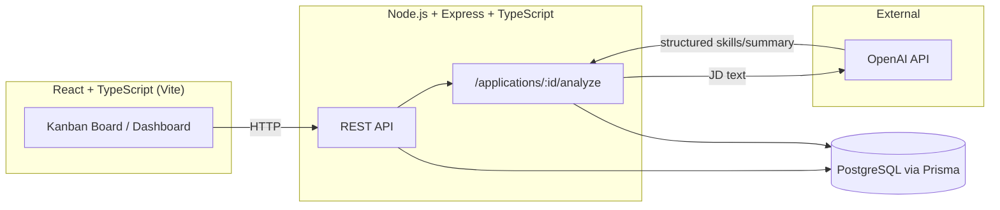

# Job Application Tracker

A full-stack job application tracker with AI-powered job description analysis and skill-match scoring. Built to track real applications while getting hands-on production experience with TypeScript and PostgreSQL.

**Status:** 🚧 In progress — see [Roadmap](#roadmap) below.

## Features (planned)

- Full CRUD for job applications (company, role, status, dates, notes, resume variant used)
- AI-powered job description parsing: extracts required/preferred skills, seniority, and a summary
- Skill match scoring against a verified skill set, with a 0–100 fit score and matched/missing breakdown
- Resume variant suggestion based on the fit score breakdown
- Kanban board (Applied / Interviewing / Rejected / Offer) with drag-and-drop
- Dashboard with applications-over-time, response-rate-by-status, and fit-score-trend charts

## Tech Stack

**Backend:** Node.js, Express, TypeScript, PostgreSQL, Prisma ORM, Zod (validation), OpenAI API
**Frontend:** React, TypeScript, Vite, Tailwind CSS, Recharts, @dnd-kit
**Tooling:** ESLint, Prettier
**Deployment:** Railway/Render (backend), Vercel (frontend), Neon/Supabase (Postgres)

## Architecture



## Data Model

- **Application** — company, role, status, appliedDate, jobUrl, resumeVariant, notes, fit score
- **Company** — name, industry, size
- **Contact** — name, role, email, linkedinUrl (linked to an Application)
- **Skill / UserSkill** — verified skill set used for match scoring

## Setup

> Setup instructions will be filled in as each part of the stack is built.

```bash
# Backend
cd server
npm install
cp .env.example .env   # add DATABASE_URL, OPENAI_API_KEY
npx prisma migrate dev
npm run dev

# Frontend
cd client
npm install
npm run dev
```

## Roadmap

- [ ] **Phase 1** — Backend scaffold: Express + TypeScript + Prisma schema, CRUD API, seed data
- [ ] **Phase 2** — AI job description analysis + skill match scoring endpoint
- [ ] **Phase 3** — React frontend: kanban board, application detail view, dashboard charts
- [ ] **Phase 4** — Deployment (Railway/Render + Vercel) and polish

## Screenshots

_Coming soon once the frontend is built._

## License

MIT
